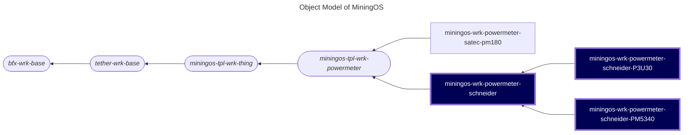

# miningos-wrk-powermeter-schneider

## Table of Contents

1. [Overview](#overview)
    1. [Purpose](#purpose)
    2. [Supported Power Meter Types](#supported-power-meter-types)
    3. [Components](#components)
2. [Architecture](#architecture)
    1. [Object Model](#object-model)
    2. [Worker Types](#worker-types)
    3. [Worker Lifecycle](#worker-lifecycle)
3. [Core Features](#core-features)
    1. [Real-Time Data (RTD) Collection](#real-time-data-rtd-collection)
    2. [Device Type Management](#device-type-management)
    3. [Tag System Integration](#tag-system-integration)
4. API Extensions
5. Brand Implementations
6. Configuration
7. Best Practices

## Overview

The A power meter workers (in documentation, `miningos-wrk-powermeter-schneider`) are specialized Node.js services that directly extends [Powermeter Worker](https://github.com/tetherto/miningos-tpl-wrk-powermeter) providing industrial-grade monitoring and management capabilities for **Schneider [power meters (PM5340)](https://www.se.com/us/en/product/METSEPM5340/power-meter-powerlogic-pm5340-ethernet-up-to-31st-harmonic-256kb-2di-2do-35-alarms/) and [protection relays (P3U30)](https://www.se.com/my/en/product/P3U30/universal-protection-relay-powerlogic-p3u30-universal-protection-feeder-and-motors/)**. Built on the extensible [miningos-tpl-wrk-thing](https://github.com/tetherto/miningos-tpl-wrk-thing/) framework, this worker enables real-time data collection, historical analysis, and remote management of power measurement devices through a distributed, rack-based architecture.

This worker serves as a critical component in energy management systems, data center monitoring, and industrial power quality analysis applications, providing high-frequency sampling of electrical parameters with built-in fault tolerance and scalability features.

### Purpose

The aforementioned workers for are specialized industrial IoT service designed to interface with Schneider PM5340 and P3U30 devices through Modbus TCP/IP protocol. They provide real-time monitoring, data collection, and control capabilities for electrical power measurement infrastructure.

The table below contains specifications of the Schneider devices.

| Category                  | **PM5340 (Power Meter)**                                                                 | **Easergy P3U30 (Protection Relay)**                                      |
|---------------------------|------------------------------------------------------------------------------------------|---------------------------------------------------------------------------|
| **Primary purpose**       | Revenue-/monitoring-grade power/energy metering                                          | Protection & control of feeders/motors with measurement as support        |
| **Electrical Quantities** | - Voltage (L-N, L-L)<br>- Current (per phase + neutral)<br>- Active, reactive, apparent power<br>- Power factor<br>- Frequency | - Currents (3 phase + neutral)<br>- Voltages (depends on VT inputs)<br>- Power, PF, frequency (for protection functions) |
| **Energy Data**           | - Active energy (kWh import/export)<br>- Reactive energy (kvarh)<br>- Apparent energy (kVAh) | - Cumulative energy counters (less detailed, not revenue-grade)           |
| **Quality / Analysis**    | - THD (voltage & current)<br>- Harmonics (up to 15th, depending on config)<br>- Min/Max values with timestamps | - Disturbance records (waveforms during faults)<br>- Event logs (trip, alarm, operator actions) |
| **Logging / Memory**      | - 256 kB onboard memory<br>- Data/event/alarm logs<br>- Min/max demand logs             | - Fault records (last N trips)<br>- Sequence of events (SOE, ms resolution)<br>- Disturbance recorder (oscillography) |
| **Control Outputs**       | - 2 relays, 2 digital outputs (for alarms/load control)                                 | - Trip outputs, control of circuit breakers, interlocking logic           |
| **Suppored Protocols**    | - Modbus TCP/IP (fixed Unit ID 255)<br>- Modbus RTU<br>- BACnet/IP                        | - Modbus TCP/RTU<br>- IEC 61850<br>- DNP3<br>- Redundancy protocols (PRP/HSR/RSTP) |

### Supported Power Meter Types

The table below contains specifications for the respective device workers

| Model           |  **PM5340**                                          | **P3U30**                                            |
|-----------------|------------------------------------------------------|------------------------------------------------------|
| Modbus Protocol | Modbus TCP/IP                                        | Modbus TCP/RTU                                       |
| Features        | 3-phase monitoring, THD measurement, energy metering | TODO |

Key capabilities:
- **Real-time Monitoring**: Continuous collection of electrical parameters including voltage, current, power, energy, frequency, and power quality metrics
- **Industrial Protocol Support**: Native Modbus TCP/IP communication with configurable timeout and retry mechanisms
- **Time-series Data Storage**: Automatic logging of power measurements with configurable retention periods
- **Alert Processing**: Detection and notification of power anomalies, quality issues, and communication failures
- **Distributed Architecture**: Rack-based design allows horizontal scaling across multiple worker instances
- **High Availability**: Built-in replication support for mission-critical deployments

**Note**: While this implementation is specifically designed for the models P3U30 and PM5340, the modular architecture allows for easy extension to support additional Schneider power meter models in the future.


### Detailed Component Architecture

**Schneider Power Meter 5340 Worker:**

```mermaid
graph TB
    subgraph "Schneider PM5340 Worker Process"
        RPC[RPC Interface<br/>net_r0.rpcServer]
        Worker[WrkPowerMeterRack<br/>PM5340 Instance]
        
        subgraph "Facilities Layer"
            Interval[Interval Facility<br/>- collectSnaps<br/>- rotateLogs<br/>- refreshReplica]
            Scheduler[Scheduler Facility<br/>- buildStats<br/>- stat timeframes<br/>- RTD scheduling]
            Store[Store Facilities<br/>- store_s0: metadata<br/>- store_s1: data]
            Net[Network Facility<br/>- RPC/DHT]
            ModbusFac[Modbus Facility<br/>- svc-facs-modbus<br/>- TCP client pool<br/>- Connection manager]
        end
        
        subgraph "Data Layer"
            Memory[Memory Cache<br/>- things<br/>- log_cache<br/>- pm5340_connections<br/>- rtd_buffer]
            
            subgraph "Hyperbee Storage"
                MainDB[(Main DB)]
                Things[(things)]
                MetaLogs[(meta_logs)]
                TimeLogs[(Time-series Logs<br/>- thing-5m-id<br/>- thing-alerts<br/>- stat-timeframe<br/>- rtd-t-powermeter)]
            end
        end
        
        subgraph "PM5340 Library"
            PM5340Lib[PM5340PowerMeter<br/>./lib/powermeter]
            Registers[Register Mappings<br/>- Voltage: 0x0000-0x0006<br/>- Current: 0x0008-0x000E<br/>- Power: 0x0010-0x0018<br/>- Energy: 0x0100-0x0108<br/>- THD: 0x0200-0x0206]
            Parser[Data Parser<br/>- IEEE 754 float<br/>- Scaling factors<br/>- Unit conversion]
            
            PM5340Lib --> Registers
            PM5340Lib --> Parser
        end
        
        RPC -->|handles requests| Worker
        Worker -->|initializes| Interval
        Worker -->|initializes| Scheduler
        Worker -->|initializes| Store
        Worker -->|initializes| Net
        Worker -->|initializes with '0'| ModbusFac
        
        Worker -->|reads/writes| Memory
        Store -->|manages| MainDB
        MainDB --> Things
        MainDB --> MetaLogs
        Store -->|manages| TimeLogs
        
        Worker -->|instantiates| PM5340Lib
        PM5340Lib -->|uses getClient| ModbusFac
    end
    
    subgraph "External Connections"
        PM5340Devices[Schneider PM5340<br/>Power Meters]
        ModbusProto[Modbus TCP<br/>Port: 502<br/>Unit ID: 1-247]
        
        PM5340Lib -->|collectThingSnap| PM5340Devices
        ModbusFac -->|TCP connection| ModbusProto
        ModbusProto -->|reads registers| PM5340Devices
    end
    
    subgraph "PM5340 Snapshot Data"
        SnapData[Snapshot Structure<br/>- voltage: L1/L2/L3/avg<br/>- current: L1/L2/L3/avg<br/>- power: active/reactive/apparent/PF<br/>- energy: import/export<br/>- frequency: Hz<br/>- thd: voltage/current per phase]
        
        Parser -->|produces| SnapData
        SnapData -->|stored in| TimeLogs
    end
    
    subgraph "PM5340 Specific Extensions"
        RTDConfig[RTD Configuration<br/>5-second intervals]
        TypeOverride[Type Override<br/>getThingType<br/>returns powermeter-schneider-pm5340]
        TagExtension[Tag Extension<br/>getThingTags returns schneider<br/>getSpecTags returns powermeter]
        InfoSelect[Info Selector<br/>selectThingInfo<br/>returns address/port/unitId]
        
        Worker --> RTDConfig
        Worker --> TypeOverride
        Worker --> TagExtension
        Worker --> InfoSelect
        RTDConfig -->|configures| Scheduler
    end
    
    style RPC fill:#1976d2,stroke:#0d47a1,color:#fff
    style Worker fill:#388e3c,stroke:#1b5e20,color:#fff
    style Memory fill:#f57c00,stroke:#e65100,color:#fff
    style MainDB fill:#7b1fa2,stroke:#4a148c,color:#fff
    style Things fill:#7b1fa2,stroke:#4a148c,color:#fff
    style MetaLogs fill:#7b1fa2,stroke:#4a148c,color:#fff
    style TimeLogs fill:#7b1fa2,stroke:#4a148c,color:#fff
    style PM5340Devices fill:#00796b,stroke:#004d40,color:#fff
    style ModbusProto fill:#5d4037,stroke:#3e2723,color:#fff
    style Interval fill:#303f9f,stroke:#1a237e,color:#fff
    style Scheduler fill:#303f9f,stroke:#1a237e,color:#fff
    style Store fill:#303f9f,stroke:#1a237e,color:#fff
    style Net fill:#303f9f,stroke:#1a237e,color:#fff
    style ModbusFac fill:#303f9f,stroke:#1a237e,color:#fff
    style RTDConfig fill:#d32f2f,stroke:#b71c1c,color:#fff
    style TypeOverride fill:#d32f2f,stroke:#b71c1c,color:#fff
    style TagExtension fill:#d32f2f,stroke:#b71c1c,color:#fff
    style InfoSelect fill:#d32f2f,stroke:#b71c1c,color:#fff
    style PM5340Lib fill:#0277bd,stroke:#01579b,color:#fff
    style Registers fill:#0277bd,stroke:#01579b,color:#fff
    style Parser fill:#0277bd,stroke:#01579b,color:#fff
    style SnapData fill:#00838f,stroke:#006064,color:#fff
```



## Architecture

### Object Model

The following is a fragment of [MiningOS object model](https://docs.mos.tether.io/) that contains the classs for workers for "Schneider power meters" (highlighted in blue). The rounded nodes reprsent abstract classes and the one square node represents a concrete class:



> According to UML notation, abstract classes have their names in Italic. 'Stadium shape' applied for abstract class nodes for better visualization.

> Sibling class for Satec power meter worker added for exemplification.

### Worker Types
The **Schneider PowerMeters** worker fits in fourth level of the following standard inheritance hierarchy:

#### Inheritance Levels

```
Level 1: bfx-wrk-base (Foundation)
    ↓
Level 2: tether-wrk-base (Foundation)
    ↓
Level 3: miningos-tpl-wrk-thing/WrkProcVar (Thing Management Base)
    ↓
Level 4: miningos-tpl-wrk-powermeter (PowerMeter Template)
    ↓
Level 5: Schneider power meter workers (as well as other brands') Specific Implementations
    ↓
Level 6: Schneider power meter workers  Specific Implementations Models
```

#### Level 1: [Foundation](https://github.com/bitfinexcom/bfx-wrk-base)
- **bfx-wrk-base**: Core worker functionality (configuration, facilities, lifecycle)

#### Level 2: [Foundation](https://github.com/tetherto/tether-wrk-base)
- **tether-wrk-base**: Core worker functionality (configuration, facilities, lifecycle)

#### Level 3: [Thing Management Base](https://github.com/tetherto/miningos-tpl-wrk-thing/)
- **miningos-tpl-wrk-thing (WrkProcVar)**: Abstract base implementing:
  - Thing CRUD operations
  - RPC interface
  - Storage management
  - Replication logic
  - Abstract methods for device interaction

#### Level 4: [PowerMeter Template](https://github.com/tetherto/miningos-tpl-wrk-powermeter)
- **miningos-tpl-wrk-powermeter (WrkPowerMeterRack)**: Power monitoring specialization:
  - RTD scheduling configuration
  - PowerMeter type definition
  - Tag system for power meters
  - Base methods remain abstract for brand implementation

#### Levels 5 and 6: Concrete Implementation(s) --- Schneider-pm5340 
Brand and model-specific worker that implements actual device communication:

**Schneider Implementation**: The Schneider PM5340 and PU40 workers satisfy all 5 requirements of Level 6 as follows:

1. **Add Protocol Facility**: 
  ```javascript
  init() {
    super.init()
    this.setInitFacs([['fac', 'svc-facs-modbus', '0', '0', {}, 0]])
  }
```

2. **Extend Type Definition**:
```javascript
// Like in other concrete worker classes, for PM5340, we have:
getThingType() {
  return super.getThingType() + '-pm5340'  // Returns 'powermeter-schneider-pm5340'
}
// Analogously for P3U30, we have:
getThingType() {
  return super.getThingType() + '-p3u30'  // Returns 'powermeter-schneider-p3u30'
}
```

3. **Implement connectThing()**:
```javascript
async connectThing(thg) {
  if (!thg.opts.address || !thg.opts.port || thg.opts.unitId === undefined) {
    return 0
  }
  const powermeter = new PM180PowerMeter({
    ...thg.opts,
    getClient: this.modbus_0.getClient.bind(this.modbus_0),
    conf: this.conf.thing.powermeter || {},
    collectSnapsItvMs: this.conf.thing.collectSnapsItvMs || 60000
  })
  powermeter.on('error', (e) => {
    this.debugThingError(thg, e)
  })
  thg.ctrl = powermeter
  return 1
}
```

4. **Implement collectThingSnap()**:
```javascript
async collectThingSnap(thg) {
  return thg.ctrl.getSnap()
}
```

5. **Define selectThingInfo()**:
```javascript
selectThingInfo(thg) {
  return {
    address: thg.opts?.address,
    port: thg.opts?.port,
    unitId: thg.opts?.unitId
  }
}
```

### Worker Lifecycle

#### 1. Process Entry and Worker Creation
When the Node.js process starts:

1a. CLI Parsing (bfx-svc-boot-js/index.js)

1b. Worker File Resolution (bfx-svc-boot-js/lib/worker.js)

1c. Context Creation and Instantiation

#### 2. Initialization Chain
Initialization proceeds through the inheritance hierarchy:

2a. Base Class Initialization (bfx-wrk-base/base.js)

2b. Thing Worker Initialization (rack.thing.wrk.js)

2c. PowerMeter Template Initialization

2d. Brand Implementation Initialization

#### 3. Startup Execution

3a. Facility Startup (bfx-wrk-base/base.js)

3b. Main Startup (rack.thing.wrk.js::_start())

#### 4. Thing Loading Process (setupThings())

#### 5. Operational State

5a. Master Node Operations

5b. Slave Node Operations

5c. Snapshot Collection (60-second intervals)

5d. RTD Collection (5-second intervals)

#### 6. Shutdown Process

## Core Features

### 1. Real-Time Data (RTD) Collection

The template automatically configures high-frequency data collection:
```javascript
init() {
    super.init()
    
    // Schedule RTD collection every 5 seconds
    this.scheduleAddlStatTfs = [
        ['rtd', '*/5 * * * * *']
    ]
}
```
This enables:
- 5-second granularity for current power metrics
- Latest values available for monitoring systems
- Foundation for external trending systems to poll and store data

### 2. Device Type Management

The template provides standardized type identification:
```javascript
getThingType() {
    return 'powermeter'  // Base type for all power meters
}

_getThingBaseType() {
    return 'powermeter'  // Used for statistics aggregation
}
```

Concrete implementations extend this:
```javascript
// In Schneider P3U30 implementation
getThingType () {
    return super.getThingType() + '-p3u30'
}
// In Schneider PM5340 implementation
getThingType () {
    return super.getThingType() + '-pm5340'
}
```

### 3. Tag System Integration

Automatic tagging for device categorization:

```javascript
// Concrete implementations add brand tags
getThingTags() {
    return ['schneider']
}
```
